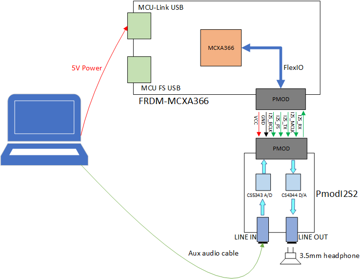
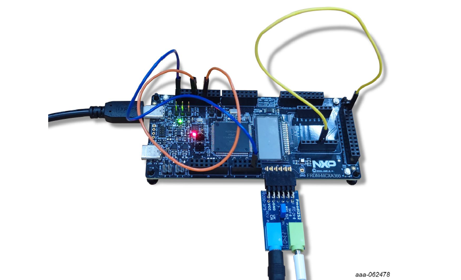
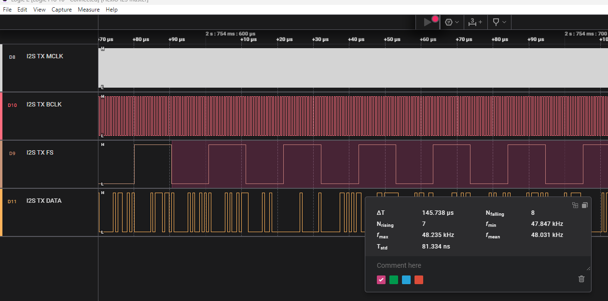

# NXP Application Code Hub

## AN14794 Emulating I2S bus with FlexIO on MCXA366

This application note describes how to emulate I2S interface with FlexIO on MCXA156 and implement a USB speaker device on MCXA156. The audio function is tested using the codec on LPCXpress55s69 board.

In this application note, the I2S interface emulated by FlexIO is used as an I2S master. The audio format used in this application note is as follows:
- Transmit mode: Classic I2S mode
- Frame word count: 2
- Wordlength: 16
- BCLK frequency: 1.536 MHz
- FSYNC frequency: 48 KHz 
- MCLK frequency: 12.288 MHz

#### Boards: FRDM-MCXA366, PmodI2S2
#### Categories: Audio
#### Peripherals: I2S, FlexIO, DMA
#### Toolchains: MCUXpresso IDE

## Table of Contents
1. [Software](#step1)
2. [Hardware](#step2)
3. [Setup](#step3)
4. [Results](#step4)
5. [FAQs](#step5) 
6. [Support](#step6)
7. [Release Notes](#step7)

## 1. Software
- [MCUXpresso IDE v24.12 [Build 148] [2025-01-10] or later](https://www.nxp.com/design/software/development-software/mcuxpresso-software-and-tools-/mcuxpresso-integrated-development-environment-ide:MCUXpresso-IDE)
- [SDK_2.16.0_FRDM-MCXA156](https://mcuxpresso.nxp.com/en/welcome)
- MCUXpresso for Visual Studio Code: This example supports MCUXpresso for Visual Studio Code, for more information about how to use Visual Studio Code please refer [here](https://www.nxp.com/design/training/getting-started-with-mcuxpresso-for-visual-studio-code:TIP-GETTING-STARTED-WITH-MCUXPRESSO-FOR-VS-CODE).
## 2. Hardware
- FRDM-MCXA366 board
- PmodI2S2 board
- One Type-C USB cable.
- 3.5mm Headphone
- 3.5mm audio cable
- 3 DuPont wires
## 3. Setup

### 3.1 Hardware connection

You can connect the PmodI2S2 board to the PMOD interface J7 on FRDM-MCXA366 directly, as shown in below figure. The detailed connection between FRDM-MCXA366 and PmodI2S2 boards as shown below:

  |Power and I2S signals|FRDM-MCXA366|PmodI2S2|
  |--|--|--|
  |I2S_TX_MCLK|J7_1/P1_6/FlexIO_D14|J1_1/DA MCLK|
  |I2S_TX_FS|J7_3/P1_0/FlexIO_D8|J1_2/DA LRCK|
  |I2S_TX_BCLK|J7_5/P1_2/FlexIO_D10|J1_3/DA SCLK|
  |I2S_TX_DATA|J7_7/P1_1/FlexIO_D9|J1_4/DA SDIN|
  |GND|J7_9/GND|J1_5/GND|
  |VCC|J7_11/VDD_BOARD|J1_6/VCC|
  |I2S_RX_MCLK|J7_2/P1_6|J1_7/AD MCLK|
  |I2S_RX_FS|J7_4/P1_0|J1_8/AD LRCK|
  |I2S_RX_BCLK|J7_6/P1_2|J1_9/AD SCLK|
  |I2S_RX_DATA|J7_8/P1_1/FlexIO_D28|J1_10/AD SDOUT|
  |GND|J7_10/GND|J1_11/GND|
  |VCC|J7_12/VDD_BOARD|J1_12/VCC|

In this application note, we use three FlexIO timers to generate I2S_TX_MCLK, I2S_TX_BCLK and I2S_TX_FS clocks. Since the FlexIO of MCXA366 supports up to four timers, we do not have enough timers to generate I2S_RX_MCLK, I2S_RX_BCLK and I2S_RX_FS clocks, but we can share the TX channel clocks with the RX channel, so we can directly connect them together on the FRDM-MCXA366 board. The connection is as follows:

  |TX channel||RX channel||
  |--|--|--|--|
  |I2S_TX_MCLK|J2_11/P1_6/FLEXIO_D14|I2S_RX_MCLK|J2_7/P1_4/FLEXIO_D12|
  |I2S_TX_FS|J4_10/P1_0/FLEXIO_D8|I2S_RX_FS|J2_19/P1_5/FLEXIO_D13|
  |I2S_TX_BCLK|J6_5/P1_2/FLEXIO_D10|I2S_RX_BCLK|J8_3/P3_27/FLEXIO_D27|

  

### 3.2 Test

This section will describes how to test the function of emulating I2S with FlexIO on FRDM-MCXA366 and PmodI2S2 board.
-	Use a type-C cable to connect J15 on FRDM-MCXA366 board to PC.
- Compile the mcxa366_flexio_i2s project and download it to FRDM-MCXA366 board.
- Use a 3.5mm audio cable to connect PC and the LINE IN jack on PmodI2S2 board.
- Connect a 3.5mm headphone to the LINE OUT jack on PmodI2S2 board.
- Short the I2S RX MCLK, BCLK and FS to I2S TX MCLK, BCLK and FS on FRDM-MCXA366 board.
   - MCLK: short J2_11/P1_6/FLEXIO_D14 and J2_7/P1_4/FLEXIO_D12
   - BCLK: short J6_5/P1_2/FLEXIO_D10 - J8_3/P3_27/FLEXIO_D27
   - FS: short J4_10/P1_0/FLEXIO_D8 - J2_19/P1_5/FLEXIO_D13

You can play any audio file on your PC, then PC will send audio data to PmodI2S2 board via 3.5mm audio cable, then the audio data is sent to MCXA366 via the I2S RX DATA pin emulated by FlexIO, MCXA366 sent the audio data to PmodI2S2 board via the I2S TX DATA pin emulated by FlexIO, then you can hear the audio from the LINE OUT jack. 

## 4. Results
When you play music on your PC, you can hear the music through the headphones connected to the LINE OUT jack. You can also use a logic analyzer to capture the waveform of the I2S emulated by FlexIO, as shown below.

  

## 5. FAQs
*Include FAQs here if appropriate. If there are none, then remove this section.*

## 6. Support
*Provide URLs for help here.*

#### Project Metadata

<!----- Boards ----->

<!----- Categories ----->

<!----- Peripherals ----->

<!----- Toolchains ----->

Questions regarding the content/correctness of this example can be entered as Issues within this GitHub repository.

>**Warning**: For more general technical questions regarding NXP Microcontrollers and the difference in expected functionality, enter your questions on the [NXP Community Forum](https://community.nxp.com/)

## 7. Release Notes
| Version | Description / Update                           | Date                        |
|:-------:|------------------------------------------------|----------------------------:|
| 1.0     | Initial release on Application Code Hub        | September 2nd 2025 |

## Licensing

*If applicable - note software licensing here with links to licenses, otherwise remove this section*

## Origin

*if applicable - note components your application uses regarding to license terms - with authors / licenses / links to licenses, otherwise remove this section*